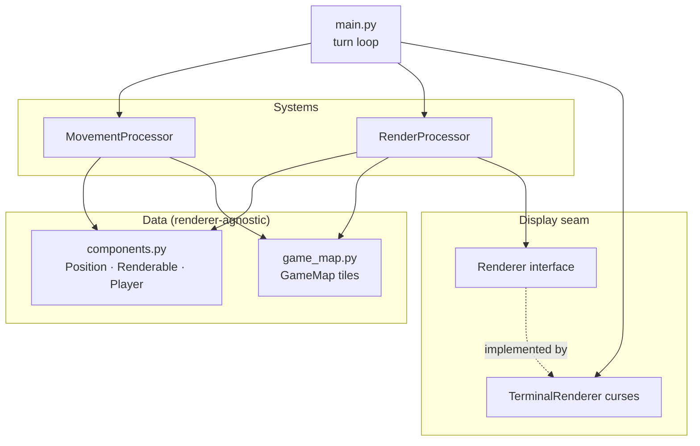
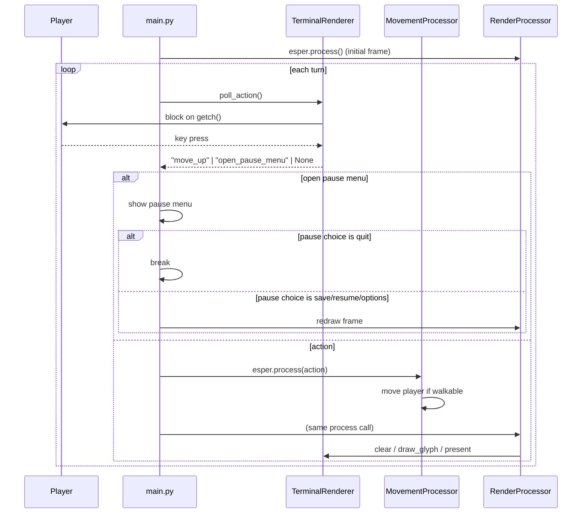

# Architecture

## ECS in one paragraph

Entity-Component-System splits the game into three parts: **entities** are just
ids, **components** are plain data attached to entities, and **systems**
(processors, in esper's vocabulary) contain all the behaviour. Instead of a
`Player` class with position + rendering + movement baked in, the player is an
entity that *has* a `Position`, a `Renderable`, and a `Player` tag; separate
systems read those components and do work. Behaviour composes by adding
components, not by subclassing.

## esper 3.x model

esper 3.x keeps ECS state in **module-level** globals rather than a `World`
object. The calls used here:

| Call | Purpose |
|------|---------|
| `esper.create_entity(*components)` | Make an entity from components |
| `esper.add_processor(proc, priority=0)` | Register a system; higher priority runs first |
| `esper.get_components(A, B)` | Iterate `(entity, (a, b))` for entities having both |
| `esper.component_for_entity(ent, A)` | Fetch one component off one entity |
| `esper.process(*args)` | Run every processor's `process(*args)` in priority order |

## Layering



The arrows only ever point *toward* data and the `Renderer` interface. Nothing in
Data or Systems imports curses.

## The turn loop

The game is turn-based: it blocks for input, runs the systems once, and repeats.



`esper.process(action)` runs **both** processors and passes `action` to each.
`MovementProcessor` uses it; `RenderProcessor` ignores it. Priority ordering
(`MovementProcessor` at `priority=1`, `RenderProcessor` at `priority=0`)
guarantees movement is applied *before* the frame is drawn.

## Data flow of a keypress

1. `TerminalRenderer.poll_action()` reads a raw key and maps it to an action
    string (`move_left`, `menu_select`, `open_pause_menu`, ...).
2. `main.py` passes it to `esper.process("move_left")`.
3. `MovementProcessor` looks up the delta, finds every `Position` + `Player`
   entity, and moves it if `GameMap.is_walkable`.
4. `RenderProcessor` clears the frame, draws the map, draws every `Renderable`,
   draws the status line, and presents.

Pause-menu actions (`save`, `options`, `quit`) are handled in `main.py` UI flow,
not by ECS movement/render systems.

## Testing headless

Because the renderer is an interface, tests substitute a fake:

```python
class FakeRenderer(Renderer):
    def setup(self): ...
    def teardown(self): ...
    def clear(self): self.buf = {}
    def draw_glyph(self, x, y, g): self.buf[(x, y)] = g
    def draw_text(self, x, y, t): ...
    def present(self): ...
    def poll_action(self): return None
```

Register it with `RenderProcessor`, call `esper.process("move_up")`, and assert on
`buf` / the player's `Position`. No terminal required.

## Related pages

- [Components](Components.md) · [Systems](Systems.md) · [Game Map](Game-Map.md) ·
  [Renderers](Renderers.md)
